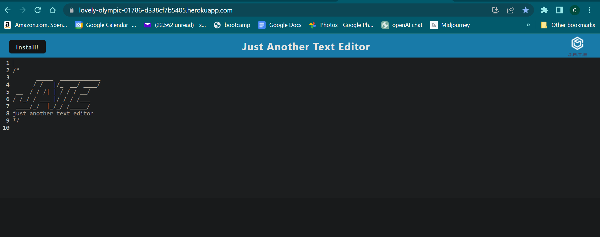

# J.A.T.E. 

## Description

J.A.T.E. or Just Another Text Editor is designed to run in the browser or it can be installed so it can function offline . It allows you to create notes or code snippets with or without internet connection. 

## Table of Contents
- [Description](#description)
- [Installation](#installation)
- [Usage](#usage)
- [Pictures](#pictures)
- [Questions](#questions)

## Installation

There are two possable ways to install : 
1. You can click on the install link on my deployed application [here](https://lovely-olympic-01786-d338cf7b5405.herokuapp.com/) it will install on your computer and you can use the desktop link it will provide. 

2. You can `git clone` the repo, make sure you are in the file you cloned into and then run `npm install` in the terminal then `npm run start:dev` then `npm start` in the browser go to http://localhost:3000 

## Deployed Link 

In case it was missed earlier in the installation instructions I am adding a link to the deployed site [here](https://lovely-olympic-01786-d338cf7b5405.herokuapp.com/) as well.

## Pictures
This is what the deplyed J.A.T.E. site looks like 

This is what some of my code for it looks like 

## Questions

For questions, please contact:

- Email: smilie_kay@yahoo.com
- GitHub: github.com/SmilieKay